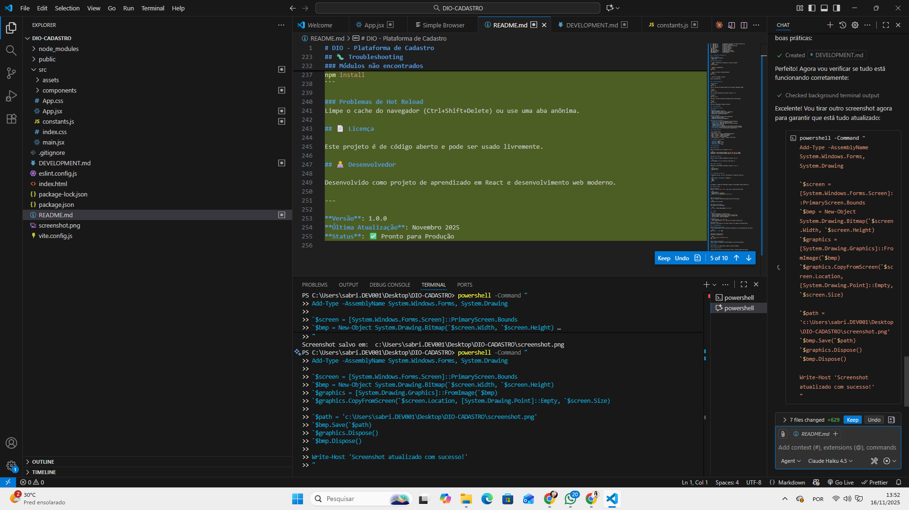

# DIO Cadastro

Uma página de cadastro moderna com design elegante em glassmorphism, construída com React e Vite.

## 📸 Preview



## ✨ O que tem aqui

- Design moderno com gradientes roxo e rosa
- Formulário com validação
- Toggle de senha funcional
- Responsivo em todos os dispositivos
- Animações suaves
- Código limpo e profissional

## 🚀 Começando

### Requisitos
- Node.js v14+
- npm ou yarn

### Instalação

```bash
# Clone ou vá para a pasta do projeto
cd DIO-CADASTRO

# Instale as dependências
npm install

# Inicie o desenvolvimento
npm run dev
```

Abra http://localhost:5174 no seu navegador.

## 📝 Comandos

```bash
npm run dev      # Desenvolvimento
npm run build    # Build para produção
npm run preview  # Visualizar build
npm run lint     # Verificar código
```

## 📂 Estrutura

```
src/
├── components/
│   ├── Navbar.jsx      - Barra de navegação
│   ├── HeroSection.jsx - Seção principal
│   └── SignUpForm.jsx  - Formulário
├── App.jsx             - Componente raiz
├── App.css             - Estilos
└── constants.js        - Configurações
```

## 🎨 Design

- **Cores**: Roxo (#a855f7) e Rosa (#ec4899)
- **Efeito**: Glassmorphism com blur
- **Animações**: Transições suaves CSS3
- **Responsivo**: Mobile, Tablet e Desktop

## 🔧 Customizar

Edite os arquivos em `src/`:
- `App.jsx` para textos e lógica
- `App.css` para estilos e cores
- `constants.js` para configurações

## 🚀 Deploy

### Vercel (Recomendado)
```bash
npm run build
# Deploy a pasta dist/ na Vercel
```

### Netlify
1. Conecte seu repositório
2. Deploy automático

### GitHub Pages
1. Settings → Pages
2. Deploy from branch (main)

## 📄 Licença

Aberto para uso pessoal e comercial.

---

Desenvolvido como projeto de aprendizado em React.

